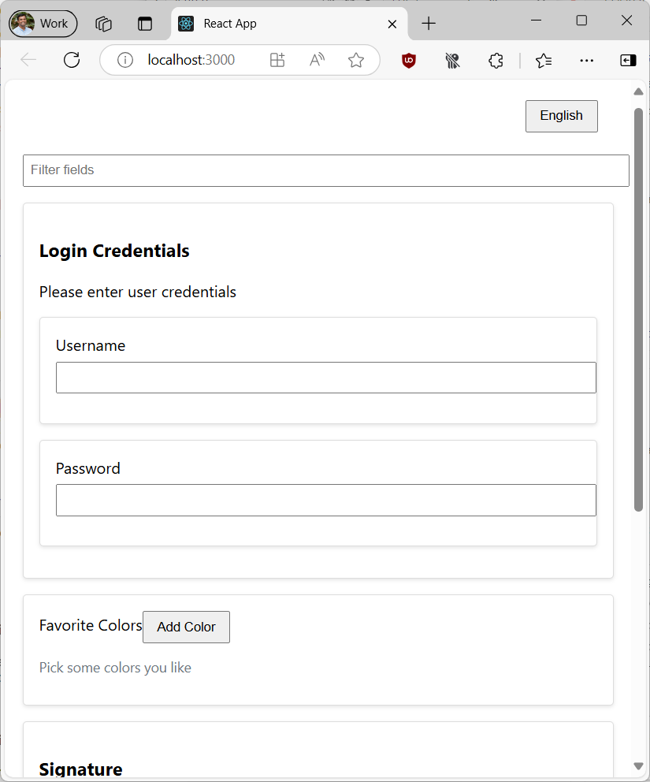

# Sample application that shows how to geneate the UI based on the schema

## What you can do?

- Search or filter fields
- Change languages
- Show validation errors

## Available Scripts

In the project directory, you can run:

### `npm start`

Runs the app in the development mode.\
Open [http://localhost:3000](http://localhost:3000) to view it in your browser.

The page will reload when you make changes.\
You may also see any lint errors in the console.

## Screenshot

